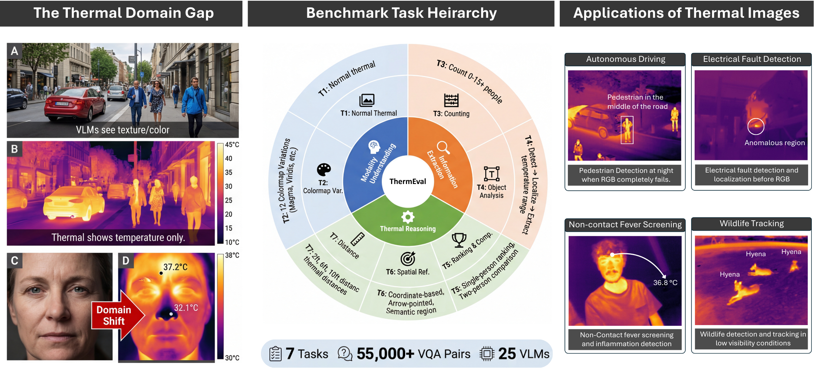
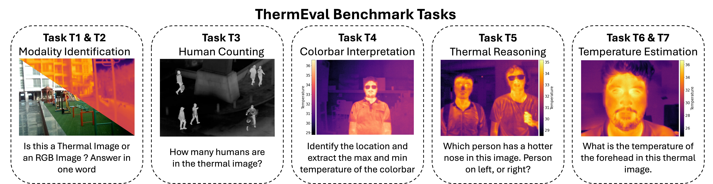
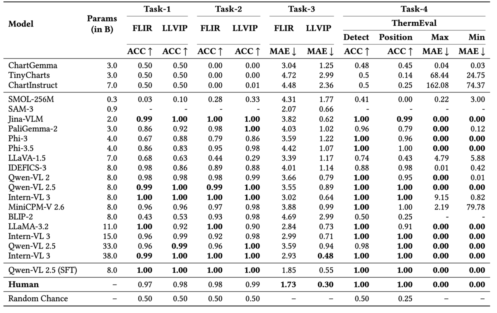
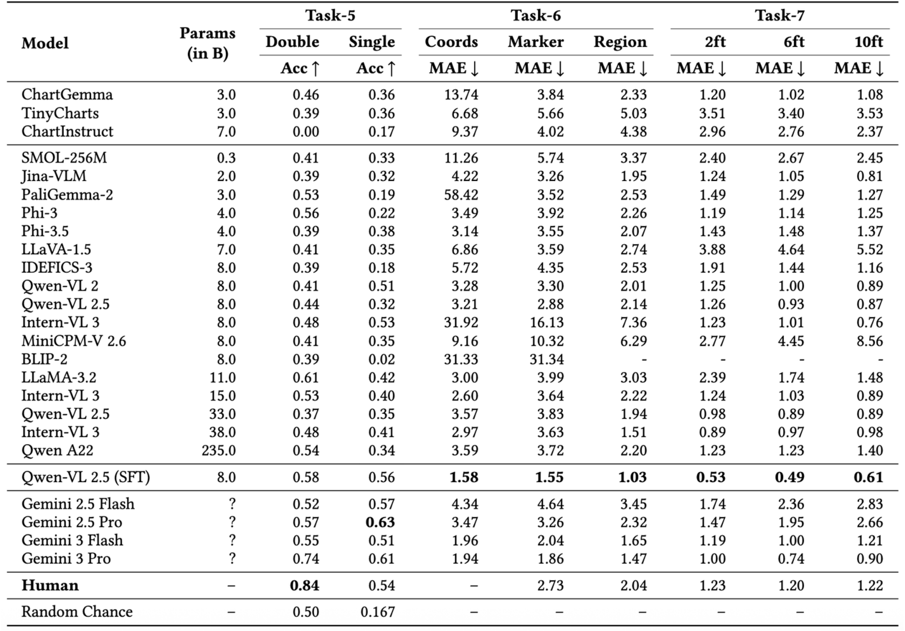
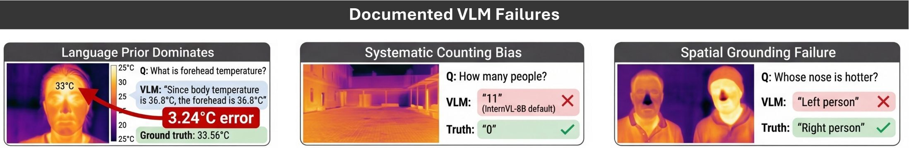

# ThermEval: A Structured Benchmark for Evaluation of Vision-Language Models on Thermal Imagery

<p align="center">
    <a href="https://sustainability-lab.github.io/thermeval/" target="_blank" rel="noopener" style="margin: 0 0px;">
        
    </a>
    <a href="https://www.kaggle.com/datasets/shriayush/thermeval" target="_blank" rel="noopener" style="margin: 0 0px;">
        
    </a>
    
    
</p>

## Overview

<p align="center">
    
</p>

This repository contains the code and evaluation framework for **ThermEval**, a structured benchmark for evaluating Vision-Language Models (VLMs) on thermal imagery understanding tasks. This is the official implementation for our KDD 2025 submission (under review).

### Key Highlights

- **Seven comprehensive evaluation tasks** spanning modality identification, counting, reasoning, and temperature estimation
- **~55,000 thermal VQA pairs** across all tasks
- **Evaluation of 25 state-of-the-art VLMs** ranging from 0.3B to 235B parameters
- **Benchmark datasets**: FLIR-ADAS, LLVIP, and ThermEval-D (our custom thermal dataset)
- **Documented systematic failure modes** of VLMs on thermal imagery

## Benchmark Tasks


<p align="center">
    
</p>

| Task | Objective | Metric | Dataset |
|------|-----------|--------|---------|
| **T1: Modality Identification (Baseline)** | Binary classification to distinguish thermal from RGB images | Accuracy | FLIR-ADAS, LLVIP |
| **T2: Modality Identification with Colormap Transformations** | Test robustness with colormap transformations (Gray, Magma, Viridis, Spring, Summer) | Accuracy | FLIR-ADAS, LLVIP |
| **T3: Human Counting** | Count pedestrians in road scenes | Mean Absolute Error | FLIR-ADAS, LLVIP |
| **T4: Colorbar Interpretation** | Detect presence, localize position, extract temperature range from colorbar | Accuracy | ThermEval-D |
| **T5: Thermal Reasoning** | Comparative reasoning between individuals & within-individual body-part ranking | Accuracy | ThermEval-D |
| **T6: Temperature Estimation** | Coordinate-based, marker-based, and region-based temperature extraction | Mean Absolute Error (in °C) | ThermEval-D |
| **T7: Multi-Distance Temperature Estimation** | Estimate temperatures across different capture distances (2ft, 6ft, 10ft) | Mean Absolute Error (in °C) | ThermEval-D |


## Repository Structure

```
ThermEval_KDD/
├── Dataset/                    # Source datasets
│   ├── FLIR/                   # FLIR-ADAS thermal images
│   ├── LLVIP/                  # LLVIP thermal images
│   └── ThermEval-D/            # Custom thermal dataset with .tiff files
│       └── Temp_Matrix/        # Temperature matrix files
├── Labels/                     # Task-specific ground truth labels
│   ├── T1/                     # Task 1 labels (thermal vs RGB)
│   ├── T2/                     # Task 2 labels (colormap variants)
│   ├── T3/                     # Task 3 labels (human counting)
│   ├── T5/                     # Task 5 labels (thermal reasoning)
│   ├── T6/                     # Task 6 labels (temperature estimation)
│   └── T7/                     # Task 7 labels (multi-distance)
├── ThermEval_Benchmark/         # Evaluation framework
│   ├── evaluation_script.py      # Task evaluation functions
│   └── model_inference.py       # Model loading and inference utilities
├── images/                     # Documentation images
├── run.py                      # Main runner script
├── README.md                   # This file
└── ThermEval_A_Structured_Benc.pdf  # Full paper
```

## Installation

### Requirements

```bash
pip install torch torchvision transformers opencv-python tifffile matplotlib tqdm pandas pillow qwen-vl-utils
```

### Tranformers
- **Phi models** → `transformers==4.40.0`
- **All other models** → `transformers==4.57.1`

### Dataset Setup

1. **Download the datasets**:
   - FLIR-ADAS: [Link](https://www.flir.com/oem/adas/thermal-dataset-form/)
   - LLVIP: [Link](https://github.com/bingcKILV/LLVIP)
   - ThermEval-D: [Kaggle](https://www.kaggle.com/datasets/shriayush/thermeval)

2. **Organize datasets** as follows:
   ```
   Dataset/
   ├── FLIR/         # FLIR images
   ├── LLVIP/        # LLVIP images
   └── ThermEval-D/  # ThermEval-D .tiff files
       └── Temp_Matrix/
   ```

## Usage

### Running a Single Task

To evaluate a specific model on a specific task:

```python
from ThermEval_Benchmark import evaluation_script, model_inference

# Load model (example: Qwen-VL 2.5 32B)
model, processor = model_inference.load_qwen_vl_2_5_32B()

# Run evaluation for Task 1
evaluation_script.evaluate_T1_T3(
    task_number=1,
    model_name='qwen_vl_2_5_32B',
    model=model,
    processor=processor,
    batch_size=4
)
```

### Running All Tasks

The provided `run.py` script evaluates all tasks for specified models:

```bash
python run.py
```

Edit `run.py` to:
- Add/remove models to evaluate
- Adjust batch sizes
- Change task selection


## Evaluation Results

### Summary of Key Findings

#### Modality Recognition (T1-T2)
- Most VLMs achieve high accuracy (>95%) on basic thermal vs RGB identification
- Performance degrades under colormap transformations, especially with complex colormaps
- Models like BLIP-2 and LLaVA-1.5 show significant drops, suggesting reliance on color statistics

#### Human Counting (T3)
- Wide performance variability: MAE ranges from 0.48 to 4.69
- Systematic failures observed: InternVL-3 8B defaults to "11" when uncertain
- Scaling helps: InternVL performance improves from 8B → 14B → 38B

#### Colorbar Interpretation (T4)
- Near-perfect detection for modern VLMs (Qwen, InternVL, Jina)
- Critical OCR failures in LLaVA-1.5, InternVL-3 8B, MiniCPM:
  - Hallucinated values (LLaVA)
  - Decimal-shift errors (InternVL-3 8B: 33.5 → 335)
  - Constant offset errors (MiniCPM: +200°C bias)

<p align="center">
    
</p>


#### Thermal Reasoning (T5)
- **Comparative reasoning**: Best open-source: 0.61 (LLaMA-3.2), Human: 0.84
- **Within-individual reasoning**: Best: 0.53 (InternVL-3 8B), Human: 0.54
- Scaling does not guarantee improvement

#### Temperature Estimation (T6-T7)
- Large models achieve MAE >3.5°C on coordinate/marker tasks
- Human baseline: 2.73°C
- **Language prior dominance**: Models output 37°C (canonical body temp) regardless of thermal signal

#### Supervised Fine-Tuning (SFT)
- Qwen-VL 2.5 8B with SFT outperforms all zero-shot models including 235B Qwen
- Matches or exceeds human performance on most tasks
- Demonstrates VLMs have latent capacity but lack thermal-domain grounding


<p align="center">
    
</p>

### Documented Failure Modes

<p align="center">
    
</p>

1. **Language Prior Dominance**: Models default to canonical body temperature (36.8-37°C) regardless of actual thermal values

2. **Systematic Counting Bias**: InternVL-3 8B defaults to "11 humans" when uncertain

3. **Spatial Grounding Failures**: Incorrect left-right discrimination in comparative reasoning

4. **Colormap Confusion**: Performance collapse under colormap transformations

5. **OCR and Numerical Extraction Errors**: Decimal point errors, order of magnitude hallucinations

6. **Fixed Response Patterns**: Models converge to narrow set of predicted values

<!-- ## License

This project is licensed under the MIT License - see the LICENSE file for details. -->

<!-- ## Contact

For questions, issues, or collaboration, please contact the authors. -->

## Acknowledgments

- FLIR for the FLIR-ADAS dataset
- LLVIP team for the LLVIP dataset
- The Hugging Face team for the Transformers library
- All model developers whose work was evaluated in this benchmark
