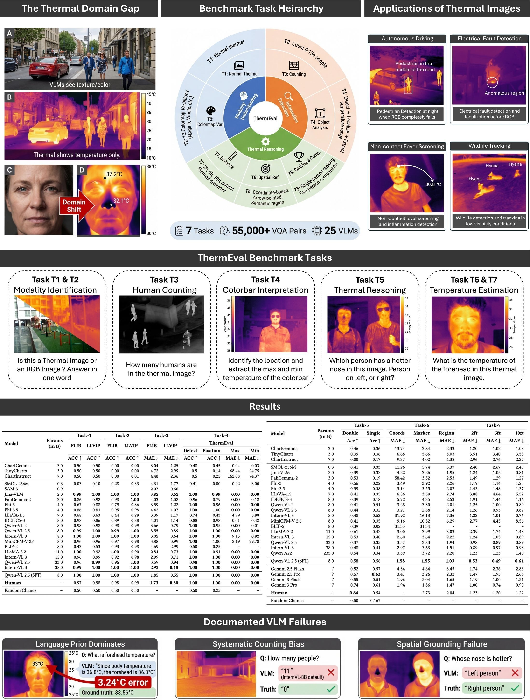

# ThermEval_KDD

Repository for the ThermEval submission to KDD. This repository contains dataset references, label files, and the evaluation/benchmarking code used for our KDD submission.

	

<!-- 

	

 -->

## Overview

- **Purpose:** Provide resources and scripts used for the ThermEval submission to KDD (datasets, labels, and benchmark evaluation code).
- **Contents:** dataset pointers, label CSVs for multiple tasks, and evaluation/inference scripts for reproducing benchmark results.

## Repository Structure
- [Dataset](Dataset): Source datasets used in experiments (subfolders for `FLIR`, `LLVIP`, and `ThermEval-D`).
- [Labels](Labels): Task-specific label CSVs. See descriptions below.
- [ThermEval_Benchmark](ThermEval_Benchmark): Evaluation and inference utilities.
	- `evaluation_script.py` — evaluation/metrics used in the benchmark
	- `model_inference.py` — inference helper for running models on the datasets
- `run.py` — (optional) top-level runner (if applicable for experiments)

**Labels and Tasks**
The `Labels` folder contains CSVs organized by task:
- `T1/`, `T2/`, `T3/` — task-specific CSV label files for `FLIR` and `LLVIP` datasets.
- `T5/`, `T6/` — single/double annotation CSVs and coordinate files used for localization/pose tasks.
- `T7/` — `annotations.csv` for the corresponding task.
- `T8/` — `T8.csv` (task-specific labels).

Refer to each CSV to understand column formats and annotation conventions used in the experiments.

## Benchmark & Evaluation
To reproduce evaluation results, use the scripts in [ThermEval_Benchmark](ThermEval_Benchmark):

Adjust script arguments as needed for dataset paths and model checkpoints. See the individual scripts for supported flags and formats.

## Reproducing Experiments
1. Prepare dataset folders under `Dataset/` as expected by the inference script.
2. Place model checkpoints or inference code accessible to `model_inference.py`.
3. Run inference to generate predictions, then run `evaluation_script.py` to compute metrics.

## Contact & Citation
This repository accompanies our KDD submission (ThermEval). For questions or collaboration, contact the authors from the submission. If you use this code or labels, please cite the ThermEval KDD paper.

